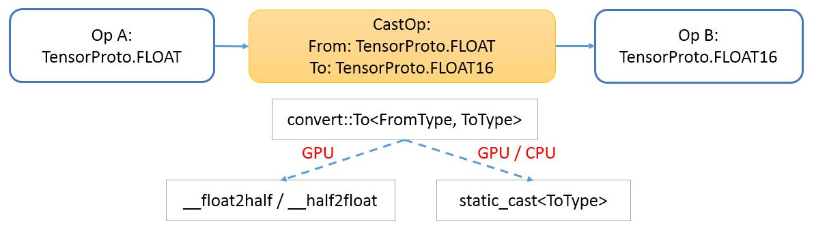

<!-- $size: 16:9 -->

# <center>Float16 and Quantized Int8 Type 

## <center>Yiqun Liu
##### <center>2017-06-27

---

<!-- page_number: true -->

# Part I, float16 - FP16, half

---

# <small>IEEE 754存储格式</small>

- [float](https://zh.wikipedia.org/wiki/%E5%96%AE%E7%B2%BE%E5%BA%A6%E6%B5%AE%E9%BB%9E%E6%95%B8)
  - <small>符号位： 1位
  - 指数位： 8位，范围 $2^{-126}$ ~ $2^{127}$
  - 尾数位：23位</small>
    
    
- [half](https://zh.wikipedia.org/wiki/%E5%8D%8A%E7%B2%BE%E5%BA%A6%E6%B5%AE%E7%82%B9%E6%95%B0)
  - <small>符号位： 1位
  - 指数位： 5位，范围 $2^{-14}$ ~ $2^{15}$
  - 尾数位：10位</small>
    

[comment]: <> (数值表示范围即指数的范围)
[comment]: <> (float，能表示2^23 * 254 = 2 billion个值)
[comment]: <> (half，只能表示2^10 * 30 = 30720个值)

---

# <small>基本类型支持</small>
- <small>caffe2 
  - <small>类型定义[caffe2/caffe2/core/types.h](https://github.com/caffe2/caffe2/blob/master/caffe2/core/types.h#L53)
    ```cpp
    namespace caffe2 {
    typedef struct CAFFE2_ALIGNED(2) __f16 { uint16_t x; } float16;
    }  // namespace caffe2
    ```
  - 类型转换 [caffe2/caffe2/utils/conversions.h](https://github.com/caffe2/caffe2/blob/master/caffe2/utils/conversions.h#L20)
    ```cpp
    inline float16 cpu_float2half_rn(float f) {
      float16 ret;
      ...
      exponent = ((u >> 23) & 0xff);
      mantissa = (u & 0x7fffff);
      ...
      ret.x = (sign | (exponent << 10) | mantissa);
      return ret;
    }
    inline float cpu_half2float(float16 h) {
      unsigned sign = ((h.x >> 15) & 1);
      unsigned exponent = ((h.x >> 10) & 0x1f);
      unsigned mantissa = ((h.x & 0x3ff) << 13);
	  ...
      unsigned i = ((sign << 31) | (exponent << 23) | mantissa);
      float ret;
      memcpy(&ret, &i, sizeof(i));
      return ret;
    }
    ```
  </small></small>

[comment]: <> (基本类型支持包括：类型定义，类型转换，计算函数。)
[comment]: <> (由于通用CPU硬件不支持half类型，因此CPU上的支持都采用软件模拟的方式，计算也都是通过转换成float操作的，因此效率会比较低下。)
[comment]: <> (总体方法是，使用位操作和移位操作，分别求出符号位、指数、尾数，然后将指数、尾数规范到范围内)
[comment]: <> (对一些特殊值，比如nan、inf等，有特殊的处理)

--- 

# <small>基本类型支持</small>
- <small>CUDA [include/cuda_fp16.h](https://github.com/ptillet/isaac/blob/master/include/external/cuda/cuda_fp16.h)
  - CUDA 7.5后 [文档](http://docs.nvidia.com/cuda/cuda-math-api/group__CUDA__MATH__INTRINSIC__HALF.html#group__CUDA__MATH__INTRINSIC__HALF)
  - 类型定义
    ```cpp
    typedef struct __align__(2) {
      unsigned short x;
    } __half;
    typedef struct __align__(4) {
      unsigned int x;
    } __half2;
    ```
  - 类型转换
    ```cpp
    __device__ __half __float2half(const float a);
    __device__ float __half2float(const __half a);
    __device__ __half2 __floats2half2_rn(const float a, const float b);
    __device__ float2 __half22float2(const __half2 a);
    ```
  - 计算函数
    ```cpp
    __device__ __half __hadd(const __half a, const __half b);
    __device__ __half2 __hadd2(const __half2 a, const __half2 b);
    ```
  </small>

---

# <small>基本类型支持</small>
- <small>majel： include/majel_lite/float16.h
- Eigen： [Eigen/src/Core/arch/CUDA/Half.h](https://bitbucket.org/eigen/eigen/src/dbab66d00651bf050d1426334a39b627abe7216e/Eigen/src/Core/arch/CUDA/Half.h?at=default&fileviewer=file-view-default#Half.h-76) 
  - 封装了基本的+,-,*,/等运算符
  - CPU上转换成float计算，GPU上调用CUDA提供的intrinsic计算
- Half-precision floating point library [http://half.sourceforge.net/](http://half.sourceforge.net/)
  - [half定义](https://github.com/headupinclouds/half/blob/master/include/half.hpp#L915)
  - 数值特性支持的最完整
  - 优化的[half2float_impl](https://github.com/headupinclouds/half/blob/master/include/half.hpp#L610), [float2half_impl](https://github.com/headupinclouds/half/blob/master/include/half.hpp#L420)实现
  - 计算的优化，比如fmax、fmin
- [类型转换的其他实现](https://gist.github.com/rygorous/2156668)
  </small>

[comment]: <> (Eigen比较详细，定义了各种数据类型之间的转换，以及运算符，CPU上转换成float来操作，GPU上调用intrinsic)
[comment]: <> (Half库，CPU功能支持的比较完善，并且做了充分的优化：)
[comment]: <> (1. half2float_impl/float2half_impl，以空间换时间，列举出2018个尾数，通过查表来转换)
[comment]: <> (2. 一些运算操作，比如fmax、fmin，根据half的组成特征，分情况使用位操作和比较操作完成，而不是转换成float来比较)
[comment]: <> (其他实现里面，包括了不同的rounding舍入方法，不同的快速实现版本，包括simd实现，但我认为应该比Half查表的方式慢)

--- 

# <small>half为什么比float快？</small>
- <small>硬件支持-NVIDIA GPU
  - `half2`类型，两路向量半精度融合乘加指令(`HFMA2`)，一条指令操作两个`half`数据
    ```cpp
    __device__ __half2 __hfma2(const __half2 a, const __half2 b, const __half2 c); // a * b + c
    ````
  - [使用示例](https://github.com/parallel-forall/code-samples/blob/master/posts/mixed-precision/haxpy.cu#L50)
    ```cpp
    __global__ void haxpy(int n, half a, const half *x, half *y) {
      int start = threadIdx.x + blockDim.x * blockIdx.x;
      int stride = blockDim.x * gridDim.x;
    #if __CUDA_ARCH__ >= 530
      int n2 = n/2;
      half2 *x2 = (half2*)x, *y2 = (half2*)y;
      for (int i = start; i < n2; i+= stride) 
        y2[i] = __hfma2(__halves2half2(a, a), x2[i], y2[i]);
      // first thread handles singleton for odd arrays
      if (start == 0 && (n%2)) y[n-1] = __hfma(a, x[n-1], y[n-1]);   
    #else
      for (int i = start; i < n; i+= stride)
        y[i] = __float2half(__half2float(a) * __half2float(x[i]) + __half2float(y[i]));
    #endif
    }
    ```
  - **Eigen内部会自动使用`half2`类型计算** [Eigen/src/Core/arch/CUDA/PacketMathHalf.h](https://bitbucket.org/eigen/eigen/src/dbab66d00651bf050d1426334a39b627abe7216e/Eigen/src/Core/arch/CUDA/PacketMathHalf.h?at=default&fileviewer=file-view-default)
  </small>

---

# <small>half为什么比float快？</small>
- 计算库支持-NVIDIA GPU
  - cuBLAS
    - `cublasHgemm`，使用FP16计算，并且作为输入输出
    - `cublasSgemmEx`，使用FP32计算，输入数据可以是FP32、FP16或INT8，输出数据可以是FP32或FP16
  - cuDNN
    - 5.0支持FP16卷积前向计算，5.1支持FP16卷积后向计算
  - 其他支持FP16 gemm的计算库：[nervanagpu](https://github.com/NervanaSystems/nervanagpu)，[openai-gemm](https://github.com/openai/openai-gemm)

---

# <small>half为什么比float快？</small>
- 硬件支持-armv8 CPU
  - 基本数据类型`float16_t`
  - 向量数据类型`float16x8_t`
  - 函数支持

---

# <small>深度学习系统中的应用</small>
- <small>caffe2
  - <small>`if`分支控制不同数据类型的计算 [caffe2/operators/fully_connected_op_gpu.cc](https://github.com/caffe2/caffe2/blob/master/caffe2/operators/fully_connected_op_gpu.cc)
    ```cpp
    template <> bool FullyConnectedOp<CUDAContext>::RunOnDevice() {
      if (Input(0).IsType<float>()) {
        return DoRunWithType<
          float, // X
          float, // W
          float, // B
          float, // Y
          float>(); // Math
      } else if (Input(0).IsType<float16>()) {
        return DoRunWithType<
          float16, // X
          float16, // W
          float16, // B
          float16, // Y
          float>(); // Math
      } else {
        CAFFE_THROW("Unsupported type");
      }
      return false;
    }
    ```
  - 只有部分Op支持float16</small>
    - <small>FullyConnectedOp, CudnnConvOp, CudnnSpatialBNOp, CuDNNPoolOp, CuDNNReluOp, CuDNNDropoutOp, MaxPoolWithIndexOp, WeightdSumOp, SumOp, CUDAAddOp</small>
  </small>

[comment]: <> (caffe2：只有一部分op支持float16)
[comment]: <> (caffe2：由于Op与数据类型DataType无关，以if语句控制不同数据类型的计算)

---

# <small>深度学习系统中的应用</small>
- <small>caffe2
  - CastOp
    - [caffe2/operators/cast_op.cc](https://github.com/caffe2/caffe2/blob/master/caffe2/operators/cast_op.cc)   
    - [caffe2/operators/cast_op.cu](https://github.com/caffe2/caffe2/blob/master/caffe2/operators/cast_op.cu)
  
    - [caffe2/experiments/python/convnet_benchmark.py](https://github.com/caffe2/caffe2/blob/master/caffe2/experiments/python/convnet_benchmarks.py#L520)
      ```python
      data_uint8, label = model.TensorProtosDBInput(
          [], ["data_uint8", "label"], batch_size=batch_size,
          db=db, db_type=db_type
      )
      data = model.Cast(data_uint8, "data_nhwc", to=core.DataType.FLOAT)
      ```
  </small>

[comment]: <> (既然相邻的Op可能使用不同的数据类型，那么caffe2是怎么控制混合精度计算的呢？答案是通过引入CastOp)
[comment]: <> (除了float16转换需求外，CastOp最常见的一个场景是图像，直接提供的是uint8数据，可通过CastOp转换成FLOAT数据)
[comment]: <> (需要手动配置CastOp)
[comment]: <> (CPU版的CastOp不支持float16的互转)
[comment]: <> (两个疑问：)
[comment]: <> (1. Cast操作是否需要作为一个Op？每个Op自动检查数据类型并自动转换数据类型是否会更好？)
[comment]: <> (2. CastOp由用户显式配置、还是由Net自动添加？)

---

# PartII, Quantized int8 - Fixed point

---

# <small>基本类型支持</small>
- tensorflow
  - 类型定义 [third_party/eigen3/unsupported/Eigen/CXX11/src/FixedPoint/FixedPointTypes.h](https://github.com/tensorflow/tensorflow/blob/master/third_party/eigen3/unsupported/Eigen/CXX11/src/FixedPoint/FixedPointTypes.h)
    - `QInt8`, `QUInt8`, `QInt16`, `QUInt16`, `QInt32`
    ```cpp
    struct QInt8 {
      QInt8() {}
      QInt8(const int8_t v) : value(v) {}
      QInt8(const QInt32 v);

      operator int() const { return static_cast<int>(value); }

      int8_t value;
    };
    ```
    - 和Tensor数据类型DataType一一对应 [tensorflow/core/framework/types.proto](https://github.com/tensorflow/tensorflow/blob/master/tensorflow/core/framework/types.proto#L27)
    - 重载这5种类型之间的基本运算符operator
      - 都是转换成int32_t来计算

[comment]: <> (定义QInt8这样一种类型的目的，是为了和int8数据区分开来)
[comment]: <> (不能直接static_cast到int8，精度损失太多)
[comment]: <> (单个元素考虑转换方法，矩阵计算没法加速)
[comment]: <> (从计算的角度、从矩阵的层面考虑定点化的方法)

---

# <small>基本类型支持</small>
- 类型转换方法一
  - 对于 $Y = W * X$
  - 若 $\tilde{W} = scale\_W * W$，且 $\tilde{X} = scale\_X * X$
  - 那么 $Y = \tilde{W} * \tilde{X} / (scale\_W * scale\_X)$
  - 取 $scale\_W = 128 / max(|W_{ij}|)$，那么 $-127 < \tilde{W}_{ij} < 128$
- 类型转换方法二
  
  - 令 $\tilde{Y}=\tilde{W} * \tilde{X}$，则 $Y_{ij}=\tilde{Y} / {scale\_W_i * scale\_X_j}$

[comment]: <> (首先，简单介绍一下我以前实现过的一种方法)

---

# <small>基本类型支持</small>
- 类型转换方法-Google
  - [On the efficient representation and execution of deep acoustic models](https://arxiv.org/abs/1607.04683)
  - 使用`QUInt8`量化，希望量化到的范围`[0, 255]`
    $$ \tilde{V} = \frac{255}{V_{max}-V_{min}} * (V - V_{min})$$
  - 令 $Q=\frac{255}{V_{max}-V_{min}}$，恢复
    $$ V = \tilde{V}*Q^{-1} + V_{min}$$
  - 作用于$Y=W*X$，可得
  $$ Y=\tilde{W}*\tilde{X}*Q_W^{-1}*Q_X^{-1} + \tilde{W}*Q_W^{-1}*X_{min} + \tilde{X}*Q_X^{-1}*W_{min}+W_{min}*X_{min}$$
  
---

# 为什么更快？
- 硬件支持-NVIDIA GPU
  - 计算库，cublas，cudnn

---

# 为什么更快？
- 硬件支持-armv7a CPU
  - 指令，intrinsic
  - 计算库，gemmlowp (google)

---

# 深度学习系统中的应用
- tensorflow


---
<!-- prerender: true -->
# <center><big><big>Thank You!</big></big>
